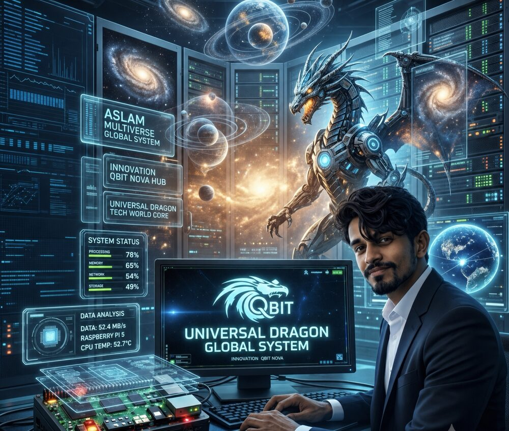

# Universal Dragon Core - QBIT NOVA

<p align="center">
  
</p>

<p align="center">
  <strong>Universal Dragon Global System</strong><br>
  QBIT NOVA · Virtual QCPU · Raspberry Pi 5 · Approval-First Architecture
</p>

UD means Universal Dragon.

Creator: Aslam
Team: Askutty
Brain: NovaKutty
Language: QBIT NOVA
Source extension: `.ud`
Version: `1.4.0-dev`
Branch: `nova-v1.4.0-dev`

QBIT NOVA is the top-level Universal Dragon language. The user writes `.ud` source files only.

## Core Identity

QBIT NOVA is not a public Python, C, C++, Java, HTML, or TypeScript project.

Other technologies may exist later only as hidden compiler/runtime targets. The visible language identity is QBIT NOVA.

## Quick Test

```bash
nova doctor
nova run examples/v2/qbit_nova_world.ud
nova qbit examples/v2/qbit_test.qnova
```

## QBIT NOVA Example

```ud
nova universal_dragon
creator aslam
team askutty
brain novakutty

say "QBIT NOVA language online"

qbit dragon = |0>
h dragon
measure dragon

guard:
  owner_approval required
  dangerous_action deny
```

<!-- NOVA_QBIT_STATUS_START -->
## NOVA QBIT Test Status

[](https://github.com/UniverseDragon14/Universal-Dragon-Core/actions/workflows/qbit-tests.yml)

Current verified QBIT features:

- QBIT NOVA `.ud` source preprocessor
- Single qbit gates: H, X, Z
- State and probability display
- Measurement collapse
- Multi-qbit register
- CNOT gate
- Bell-style linked state
- 20-run Bell repeat stability test
- Automated CI testing on `nova-v1.4.0-dev`

Latest locked milestone:

`QBIT NOVA v1.4.0-dev has started as the Universal Dragon language branch.`

<!-- NOVA_QBIT_STATUS_END -->

## Safety

QBIT NOVA allows safe adapter output and owner approval flows.

It blocks raw terminal execution through external adapters and does not allow automatic live call answering or dangerous system mutation without approval.
